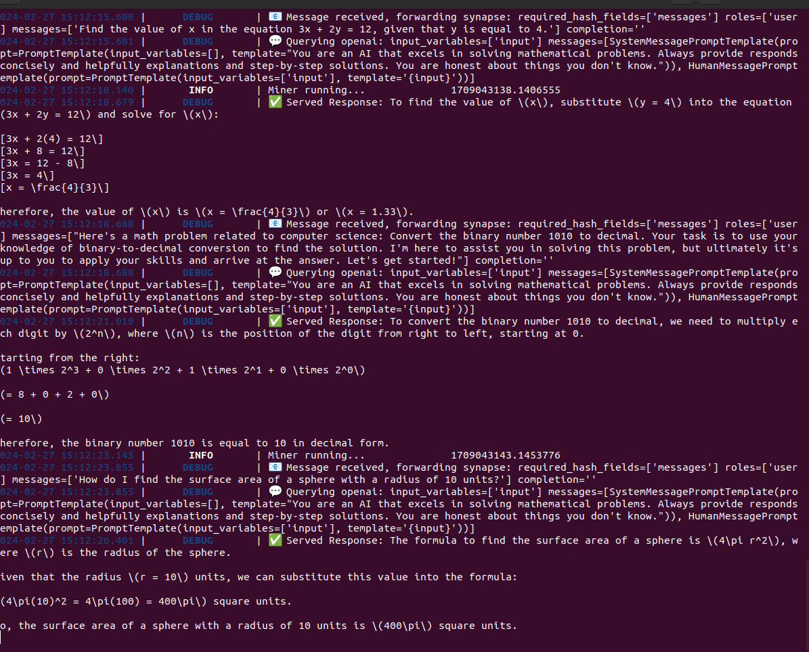

# Biττensor: Einstein Subnet Miner Setup
*How to Mine on the Bittensor Einstein Subnet (SN5)*

## 1. INSTALLATION
### Compute Requirements
#### FINE TUNED MINER (WIP) REQUIREMENTS
- GPU with 18GB or higher VRAM
- Ubuntu 20.04.01 or 22.04.01 (Recommended)
- Python 3.9 or 3.10 (Recommended)
- CUDA 12.0 or higher
#### OPENAI MINER REQUIREMENTS
- Python 3.9 or 3.10 (Recommended)
This installation process requires [Ubuntu 22.04.1](https://old-releases.ubuntu.com/releases/22.04.1/ubuntu-22.04.1-desktop-amd64.iso) and python 3.9 or 3.10.
### 1.1 BEGIN BY INSTALLING BITTENSOR:
```
/bin/bash -c "$(curl -fsSL https://raw.githubusercontent.com/opentensor/bittensor/master/scripts/install.sh)"
```
See Bittensor’s documentation for alternative installation instructions.
<Br>
**Bittensor Documentation:** [https://docs.bittensor.com/](https://docs.bittensor.com/)

### 1.2 VERIFY THE INSTALLATION:
Verify using the ***btcli*** command
```
btcli --help
```
which will give you the below output:
```

Explain
usage: btcli <command> <command args>

bittensor cli v6.1.0

positional arguments:
  {subnets,s,subnet,root,r,roots,wallet,w,wallets,stake,st,stakes,sudo,su,sudos,legacy,l}
    subnets (s, subnet)
                        Commands for managing and viewing subnetworks.
    root (r, roots)     Commands for managing and viewing the root network.
    wallet (w, wallets)
                        Commands for managing and viewing wallets.
    stake (st, stakes)  Commands for staking and removing stake from hotkey accounts.
    sudo (su, sudos)    Commands for subnet management
    legacy (l)          Miscellaneous commands.

options:
  -h, --help            show this help message and exit
  --config CONFIG       If set, defaults are overridden by passed file.
  --strict              If flagged, config will check that only exact arguments have been set.
  --no_version_checking
                        Set true to stop cli version checking.
  --no_prompt           Set true to stop cli from prompting the user.using the [Bittensor Command Line Interface](<https://docs.bittensor.com/getting-started/reference/btcli>) with **btcli --help*** and/or check the installation in python.Run the below command to install Bittensor in the above virtual environment.
```
Create a Cold & Hotkey with the commands below:
```
btcli w new_coldkey
```
```
btcli w new_hotkey
```
>   If you already have a Key, you can regenerate it ‘safely’ on a machine using btcli w regen_coldkeypub. However, you must regen the full key if you plan to register or transfer from that wallet. regen_coldkeypub lets you load the key without exposing your mnemonic to the server. If you want to, you can generate a key pair on a local safe machine to use as cold storage for the funds that you send.
```
btcli w regen_coldkeypub
```
```
btcli w regen_coldkey
```
```
btcli w regen_hotkey
```
## 2. CLONE EINSTEIN-SUBNET
```
git clone https://github.com/AIT-Protocol/einstein-ait-prod
```
Access the Einstein-Subnet Directory
```
cd einstein-ait-prod
```
## 3. EINSTEIN SUBNET DEPENDENCIES
> For optimal functionality of the Compute Subnet, it's essential to install the appropriate graphics drivers and dependencies.<br>

### Required dependencies for miners:
If you use your computer to run the miner, you need to install according to the command below: 
```
python -m pip install -r requirements.txt && python -m pip install -e .
```
If you use the **OPENAI_API_KEY** to run the miner, you need to run 2 commands below:
```
pip install -r neurons/miners/openai/requirements.txt
```
```
echo 'OPENAI_API_KEY=your_api_key_here' >> .env
```
> You can access [https://platform.openai.com/api-keys](https://platform.openai.com/api-keys) to create new api key (Secret Key) <br>

### Login to Weight and Biases
```
wandb login
```
### Install the virtual environment (Miniconda):
These quick command line instructions will get you set up quickly with the latest Miniconda installer for Linux.
```
mkdir -p ~/miniconda3
```
```
wget https://repo.anaconda.com/miniconda/Miniconda3-latest-Linux-x86_64.sh -O ~/miniconda3/miniconda.sh
```
```
bash ~/miniconda3/miniconda.sh -b -u -p ~/miniconda3
```
```
rm -rf ~/miniconda3/miniconda.sh
```
```
~/miniconda3/bin/conda init bash
```
```
~/miniconda3/bin/conda init zsh
```
>Note: You need to create a new terminal to use Miniconda.
You can visit [this link](https://docs.anaconda.com/free/miniconda/#quick-command-line-install) to see detailed instructions about Miniconda
### Install python
```
conda install python=3.10
```
### Install PM2
```
sudo apt update && sudo apt install jq && sudo apt install npm && sudo npm install pm2 -g && pm2 update 
```
Confirm pm2 is installed and running correctly
```
pm2 ls
```
You can read detail information about PM2 at [this link](https://pm2.keymetrics.io/docs/usage/quick-start/).
### Install the NVIDIA Driver
> Note: You can skip this step if you are running the miner by your **OPEN_API_KEY** 

> Note: Loading the graphics card may be corrupted because your operating system is running in secure boot mode. To avoid this error you should turn off security boot in BIOS

```
nvidia-smi
```
Output:
```
Command 'nvidia-smi' not found, but can be installed with:
sudo apt install nvidia-utils-390         # version 390.157-0ubuntu0.22.04.2, or
sudo apt install nvidia-utils-418-server  # version 418.226.00-0ubuntu5~0.22.04.1
sudo apt install nvidia-utils-450-server  # version 450.248.02-0ubuntu0.22.04.1
sudo apt install nvidia-utils-470         # version 470.223.02-0ubuntu0.22.04.1
sudo apt install nvidia-utils-470-server  # version 470.223.02-0ubuntu0.22.04.1
sudo apt install nvidia-utils-525         # version 525.147.05-0ubuntu0.22.04.1
sudo apt install nvidia-utils-525-server  # version 525.147.05-0ubuntu0.22.04.1
sudo apt install nvidia-utils-535         # version 535.129.03-0ubuntu0.22.04.1
sudo apt install nvidia-utils-535-server  # version 535.129.03-0ubuntu0.22.04.1
sudo apt install nvidia-utils-510         # version 510.60.02-0ubuntu1
sudo apt install nvidia-utils-510-server  # version 510.47.03-0ubuntu3

```
Currently I am using ubuntu 22.04.1 operating system so I choose version 535
```
sudo apt install nvidia-driver-535
```
> Note: Nvidia requires to install the correct graphics card driver version for the operating system otherwise there will be an error.
```
sudo reboot
```
Then,
```
nvidia-smi
```
The output of which should look something like:
```
+---------------------------------------------------------------------------------------+
| NVIDIA-SMI 535.154.05             Driver Version: 535.154.05   CUDA Version: 12.2     |
|-----------------------------------------+----------------------+----------------------+
| GPU  Name                 Persistence-M | Bus-Id        Disp.A | Volatile Uncorr. ECC |
| Fan  Temp   Perf          Pwr:Usage/Cap |         Memory-Usage | GPU-Util  Compute M. |
|                                         |                      |               MIG M. |
|=========================================+======================+======================|
|   0  NVIDIA Graphics Device         Off | 00000000:01:00.0  On |                  N/A |
|  0%   27C    P8               4W / 320W |    201MiB / 16376MiB |      0%      Default |
|                                         |                      |                  N/A |
+-----------------------------------------+----------------------+----------------------+
                                                                                         
+---------------------------------------------------------------------------------------+
| Processes:                                                                            |
|  GPU   GI   CI        PID   Type   Process name                            GPU Memory |
|        ID   ID                                                             Usage      |
|=======================================================================================|
|    0   N/A  N/A      1478      G   /usr/lib/xorg/Xorg                          106MiB |
|    0   N/A  N/A      1792      G   /usr/bin/gnome-shell                         86MiB |
+---------------------------------------------------------------------------------------+
```
### Install the NVIDIA CUDA Toolkit
> Note: You can skip this step if you are running the miner by your **OPEN_API_KEY** 
```
wget https://developer.download.nvidia.com/compute/cuda/12.3.1/local_installers/cuda-repo-ubuntu2204-12-3-local_12.3.1-545.23.08-1_amd64.deb
```
```
sudo dpkg -i cuda-repo-ubuntu2204-12-3-local_12.3.1-545.23.08-1_amd64.deb
```
```
sudo cp /var/cuda-repo-ubuntu2204-12-3-local/cuda-*-keyring.gpg /usr/share/keyrings/
```
```
sudo apt-get update
```
```
sudo apt-get -y install cuda-toolkit-12-3
```
```
sudo apt-get -y install -y cuda-drivers
```
```
export CUDA_VERSION=cuda-12.3
export PATH=$PATH:/usr/local/$CUDA_VERSION/bin
export LD_LIBRARY_PATH=/usr/local/$CUDA_VERSION/lib64
```
```
echo "">>~/.bashrc
echo "PATH=$PATH">>~/.bashrc
echo "LD_LIBRARY_PATH=$LD_LIBRARY_PATH">>~/.bashrc
```
```
nvcc --version
```
The output of which should look something like:
```
nvcc: NVIDIA (R) Cuda compiler driver
Copyright (c) 2005-2023 NVIDIA Corporation
Built on Fri_Nov__3_17:16:49_PDT_2023
Cuda compilation tools, release 12.3, V12.3.103
Build cuda_12.3.r12.3/compiler.33492891_0
```
You can refer to the Cuda installation documentation [here](https://developer.nvidia.com/cuda-12-3-1-download-archive?target_os=Linux&target_arch=x86_64&Distribution=Ubuntu&target_version=22.04&target_type=deb_local)
## 4. SETTING UP A MINER 
> We encourage miners to use testnet as this gives you a risk-free playground before running on mainnet. If you require test tao, please reach out to our [Subnet 5 Discord](https://discord.gg/wVPZrVu9).
### Hotkey Registration
At this point, you will need some $TAO in your coldkey address for miner registration. Once your coldkey is funded, run the command below to register your hotkey:
#### Testnet
- subtensor.network: test
- netuid: 78
```
btcli s register --subtensor.network test --netuid 78 
```
#### Mainnet
- subtensor.network: finney
- netuid: 5
```
btcli s register --subtensor.network finney --netuid 5 
```
> When running this command, you must enter the wallet name and hotkey name that we instructed in step 2.2

### Setting up ufw for miner:
**TCP Ports:** Open ports using ufw (put any number in place of xxxx and yyyy of your choice) and use them as axon port:

**Example**:  *sudo ufw allow xxxx:yyyy/tcp*
```
sudo apt install ufw
```
```
sudo ufw allow 22/tcp
```
```
sudo ufw enable
```
```
sudo ufw status
```
### Run the miner:
Move to the **einstein-ait-prod** directory and run the following command:
#### The OPENAI_API_KEY:

*Testnet:*
```
python neurons/miners/openai/miner.py --netuid 78 --subtensor.network test --wallet.name <your miner wallet name> --wallet.hotkey <your miner hotkey name> --neuron.model_id gpt-4 --neuron.max_tokens 1024 --neuron.temperature 0.9 --logging.debug
```
*Mainnet:*
```
python neurons/miners/openai/miner.py --netuid 5 --subtensor.network finney --wallet.name <your miner wallet name> --wallet.hotkey <your miner hotkey name> --neuron.model_id gpt-4 --neuron.max_tokens 1024 --neuron.temperature 0.9 --logging.debug
```
#### On localhost using PM2:
> Note: When using PM2, you will run both miner and validator. Therefore, if you just follow this guide, you will get an error because you have not set up a validator, but you can rest assured that this error will not affect the miner running.

   ```bash
   pm2 start neurons/miners/openai/miner.py --name s5_openai_miner \
   --interpreter python \
   -- --netuid <78 / 5> \ #78 is our testnet and 5 is our mainnet
   --subtensor.network <test/finney> \
   --wallet.name <your miner wallet> \
   --wallet.hotkey <your miner hotkey> \
   --logging.debug \
   # WHAT BELOW IS OPTIONAL, PLEASE READ THE DESCRIPTIONS BELOW
   --neuron.model_id gpt-3.5-turbo-0125 \
   --neuron.max_tokens 1024 \
   --neuron.temperature 0.9 \
   --neuron.top_p 0.9 \
   --neurom.top_k 50 \
   --neuron.system_prompt "your prompt engineering"
   --numpal.verbose.off \ # Set this if you want to disable verbose mode for NumPAL
   --numpal.off \ # Set this if you want to disable NumPAL (Not recommended)
   ```

   Example of running the miner with on the testnet with NumPAL on and verbose mode off:

  ```bash
  pm2 start neurons/miners/openai/miner.py --name s78_openai_miner \
  --interpreter python \
  -- --netuid 78 \
  --subtensor.network test \
  --wallet.name <your miner wallet> \
  --wallet.hotkey <your miner hotkey> \
  --logging.debug \
  --neuron.model_id gpt-3.5-turbo-0125 \
  --neuron.max_tokens 1024 \
  --neuron.temperature 0.9 \
  --neuron.top_p 0.9 \
  --neurom.top_k 50 \
  --neuron.system_prompt "your prompt engineering"
  --numpal.verbose.off
  ```


   *NOTE: Your wallet and wallet's hotkey must be created using the bittensor-cli and registered to the netuid 78 (our testnet uid). Additionally, you can run the validator in trace mode by using `--logging.trace` instead of `--logging.debug`*

   *- The `--numpal.off` flag is used to disable NumPAL. NumPAL is a feature that allows the miner to solve mathematical problems using the NumPAL supercharger model. Set this flag if you want to disable NumPAL.*

   *- The `--numpal.verbose.off` flag is used to disable logging mode for NumPAL. Set this flag if you want to disable logging mode for NumPAL.*

   *- The `--neuron.model_id` flag is used to specify the model you want to use. The default value is `gpt3.5-turbo` which is the latest model from OpenAI, you can find out more about the models [here](https://platform.openai.com/docs/models/)*

   *- The `--neuron.max_tokens` flag is used to specify the maximum number of tokens the model can generate which is the length of the response. The default value is `256`*

   *- The `--neuron.temperature` flag is used to specify the temperature of the model which controls the creativeness of the model. The default value is `0.7`*

   *- The `--neuron.top_p` This is like choosing ideas that together make a good story, instead of just picking the absolute best ones. It helps the text be both interesting and sensible. The default value is `0.95`*

   *- The `--neuron.top_k` It's like having a lot of ideas but only picking the few best ones to talk about. This makes the text make more sense.  Reducing the number ensures that the model's choices are among the most probable, leading to more coherent text. The default value is `50`*

   *- The `--neuron.system_prompt` flag is used to specify the prompt for the model. The default value is `"YYou are an AI that excels in solving mathematical problems. Always provide responses concisely and provide helpful explanations through step-by-step solutions. You are honest about things you don't know."`*

   Some useful pm2 commands:

   ```bash
   pm2 status # This will show you the status of all pm2 processes
   pm2 logs s5_openai_miner # This will show you the logs of the miner
   pm2 stop {process_id} # This will stop the process
   pm2 log # This will show you the logs of all pm2 processes
   pm2 flush # This will clear the logs of all pm2 processes.
   ```

You can add the parsers above to optimize for miners

The output when you run the miner will look something like this:

### Congratulations, you have successfully run the miner!
